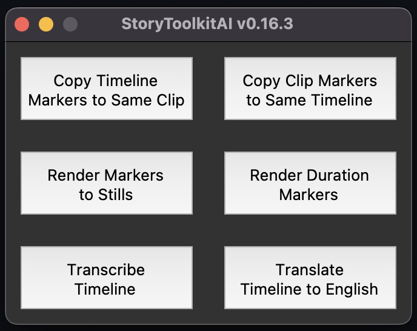

# StoryToolkitAI Installation Instructions

[Click here to the main project page](https://github.com/octimot/StoryToolkitAI)

## Have you looked for a standalone version first?
We're currently working to get the app in a standalone binary version for different operating systems and platforms,
so if you don't want to get your hands dirty with terminal commands, check if there is a release available for your 
platform [here](https://github.com/octimot/StoryToolkitAI/releases).

Please note that the standalone version may not always be up to date with the latest changes in the code, 
so if you want to be sure to have the latest features (some buggy and experimental too), you should install the app 
from source.

The development of the standalone version depends highly on the support we get from our Patreon community, so
[please consider supporting the development](https://www.patreon.com/StoryToolkitAI) if you find this tool useful
in your work.

---

## How to Install directly from GitHub
If a binary isn't available, before you attempt something silly like actually installing this tool on your machine, 
please keep in mind that by clicking on the instructions you will see many computer commands which are the main method 
used by our ancestors to tame their machines. Approach them with no fear. But do keep in mind that you might end up
ruining your computer, destroying the Internet, starting AI apocalypse, losing your job and your only real friend, have 
children out of wedlock, and/or marry your lost non-identical twin by mistake - not necessarily in that order and
highly unlikely because of the commands, but still slightly possible. Nevertheless, we're not responsible for any of it 
or anything else that might happen.

### Quick Info before we start

Our installations are on MacOS 12.6 running on M1 and Windows 10 machines, but the scripts should run fine on other 
CPUs and GPUs. For both production and development we're currently using Python 3.9.13. 

_Note: Whisper worked fine on Python 3.10.2, but we ran into problems when trying to install some packages which we're
planning to use for future developments._

**The API integration only works on Resolve Studio 18 (not on the free version).**

_Note: Unfortunately, only the Studio version of Resolve supports external scripting and Resolve versions earlier than
18 do not support Python 3.6+_

We recommend running the tool inside a virtual environment like virtualenv. This is not required, but it prevents
messing up your Python installation.

_**Important Disclaimer: you need to be comfortable using the Terminal on Mac OS, or the Command Prompt on Windows.
You should be fine even with little to no experience, but keep in mind that you are installing stuff on your machine
and there is a (very) slight chance that you'll affect your Operating System's overall performance or even the performance of
your other apps. In an unlikely worst-case scenario, some stuff might not work anymore at all and you'll need pro help
to fix them back._

## Mac OS
In the Terminal:

#### 1. You'll need Homebrew

    /bin/bash -c "$(curl -fsSL https://raw.githubusercontent.com/Homebrew/install/HEAD/install.sh)"

In case Homebrew installation fails, please check [this page](https://docs.brew.sh/Common-Issues) for troubleshooting.

One of the most common installation fails is due to the fact that Xcode Command Line Tools is not installed on your 
Mac, so you could try to install them first with `xcode-select --install`

#### 2. You'll need Python 3.9, Python Tkinter, Git, and FFMPEG:

    brew install python@3.9
    brew install python-tk@3.9
    brew install git
    brew install ffmpeg

#### 3. Make sure you now have virtualenv:

    python3.9 -m pip install virtualenv

_Note: if the pip command above doesn't work, try to use pip3 (and use pip3 for the next steps too)_

#### 4. Download StoryToolkitAI:
First, go to the Folder you want to install StoryToolkit in via Finder. Right-click on it and select "New Terminal at Folder".
Once you get another terminal window open, run:

    git clone https://github.com/octimot/StoryToolkitAI.git

This should download the app in the folder that you chose.

#### 5. Set up a virtual environment
Now create a virtual environment (to prevent messing up with other python packages you may have installed on your OS for other stuff):

    python3.9 -m virtualenv -p python3.9 venv

Right now, your installation folder should contain 2 other folders, and the tree should look like this:

    YOUR_INSTALLATION_FOLDER
    +- StoryToolkitAI
    +- venv

#### 6. Activate virtual environment
Now enable the virtual environment (this means that all the packages you'll install now via pip will be contained in the
virtual environment, meaning that for the tool to work you'll ALWAYS have to activate the virtual environment first
using the following command!)

    source venv/bin/activate

#### 7. Install OpenAI Whisper
_Note: starting with step 7, you need to make sure that you are installing packages inside the virtual environment. 
If you followed the previous steps, your terminal prompt should now have `(venv)` before everything else._

    pip install -U openai-whisper 

For more info regarding Whisper installation, please check https://github.com/openai/whisper 

If you are seeing an error message like `error: subprocess-exited-with-error` (or similar), 
you might need to install rust first, see the instructions [here](https://www.rust-lang.org/learn/get-started)

#### 8. Install all the stuff the tool requires:
_Note: starting with step 7, you need to make sure that you are installing packages inside the virtual environment. 
If you followed the previous steps, your terminal prompt should now have `(venv)` before everything else._

    pip install -r StoryToolkitAI-dev/requirements.txt

If you are running the tool on a machine with an NVIDIA CUDA GPU, make sure you install Torch with CUDA:

    pip uninstall torch
    pip cache purge
    pip install torch torchvision torchaudio --extra-index-url https://download.pytorch.org/whl/cu116

_Note: If Resolve Studio is not turned on or not available, the transcription and translation functions will work on 
normal wav files too. Simply press the transcribe or translate buttons and follow the process._

#### That's it!
Inside the virtual environment, you should now be able to start the tool:

    python StoryToolkitAI-dev/app.py

_Note: After restart of the machine or your terminal window, never forget to activate the virtual environment before
starting the app. In the folder where you created venv, run:_

    source venv/bin/activate
    
## Windows

#### 0. Open Command Prompt
First, create the folder where you want to install StoryToolkitAI. 
Then, open the Command Prompt and navigate to that folder - with Windows Explorer open in the installation folder,
type in `cmd` in the location bar above then press Enter, and your Command Prompt should start directly in the
installation folder.

#### 1. Download and install Python
Download the latest Python 3.9 version from [the official Python website](https://www.python.org/downloads/).

_Note: only use other Python installers / versions if you know what you're doing._

Then simply install it on your machine using the default settings.

To check if you installed the right version, open the Command Prompt and run:

    py --version

And something like `Python 3.9.13` should appear. Anything else besides 3.9.X means that you're in uncharted
territories! If that is the case, we recommend uninstalling all Python versions (if you don't need them of course)
and reinstalling Python 3.9.

#### 2. Download and install GIT 
Download it from [here](https://git-scm.com/download/win) and then install it.

#### 3. Download and install FFMPEG
The simplest approach is to use a package manager like [Choco](https://chocolatey.org/install). Once you follow the
installation steps for "Individual Use" on that page, you can install FFMPEG using this command:

    choco install ffmpeg

Alternatively, you can also try to download FFMPEG from [here](https://www.gyan.dev/ffmpeg/builds/) and manually 
install it, but you may need to manually add some environment variables after installation.

#### 4. Install virtualenv

If you installed Python according to step 1, this shouldn't be necessary. But to make sure that you have virtualenv,
simply run:

    py -3.9 -m pip install virtualenv

#### 5. Download StoryToolkitAI:

Open the Command Prompt and navigate to the folder where you want to install StoryToolkitAI. Then run:

    git clone https://github.com/octimot/StoryToolkitAI.git

#### 6. Set up a virtual environment
Now create a virtual environment (to prevent messing up with other python packages you may have installed on your OS
for other stuff):

    py -3.9 -m virtualenv venv

Right now, your installation folder should contain 2 other folders, and the tree should look like this:
    
    YOUR_INSTALLATION_FOLDER
    +- StoryToolkitAI
    +- venv

#### 7. Activate virtual environment
Now enable the virtual environment (this means that all the packages you'll install now via pip will be contained in the
virtual environment, meaning that for the tool to work **you'll ALWAYS have to activate the virtual environment first**
using the following command!)

    venv\Scripts\activate.bat

#### 8. Install OpenAI Whisper
Note: starting with step 7, you need to make sure that you are installing packages inside the virtual environment. If you followed the previous steps, your terminal prompt should now have (venv) before everything else.

    pip install -U openai-whisper

For more info regarding Whisper installation, please check https://github.com/openai/whisper

#### 9. Install all the stuff the tool requires:
Note: starting with step 7, you need to make sure that you are installing packages inside the virtual environment. 
If you followed the previous steps, your terminal prompt should now have (venv) before everything else.

    pip install -r StoryToolkitAI-dev\requirements.txt

If you are running the tool on a machine with an NVIDIA CUDA GPU, make sure you install Torch with CUDA:
    
    pip uninstall torch torchaudio torchvision
    pip cache purge
    pip install torch torchvision torchaudio --extra-index-url https://download.pytorch.org/whl/cu117

_Note: If Resolve Studio is not turned on or not available, the transcription and translation functions will work on 
normal wav files too. Simply press the transcribe or translate buttons and follow the process._

#### That's it!
Inside the virtual environment, you should now be able to start the tool:

    py StoryToolkitAI-dev\app.py

_Note: After restart of the machine or your terminal window, never forget to activate the virtual environment before
starting the app. In the folder where you created venv, run:_

    venv\Scripts\activate.bat

## Running the non-standalone tool

If you haven't downloaded the app in a binary format, simply activate the virtual environment and run the app.py file.

### On windows:

    venv\Scripts\activate.bat
    py StoryToolkitAI-dev\app.py

### On Mac OS:

    source venv/bin/activate
    python StoryToolkitAI-dev/app.py

A simple GUI with a mind-bending mid-2000s inspired design should appear on the screen.
Don't worry, that's intentional:

## Updates on the non-standalone tool
To update the tool, simply pull the latest changes from the repository while inside the folder where you installed the 
tool:

    git pull

Also make sure to always check for package updates after pulling a new version of the tool: 

     # on Windows
    pip install -r StoryToolkitAI\requirements.txt

    # on MacOS
    pip install -r StoryToolkitAI/requirements.txt

## Feedback

Feedback regarding these instructions is very welcome and might help others! 

Please let us know if you have any issues or suggestions for improvement via the 
[issues page](https://github.com/octimot/StoryToolkitAI/issues).
