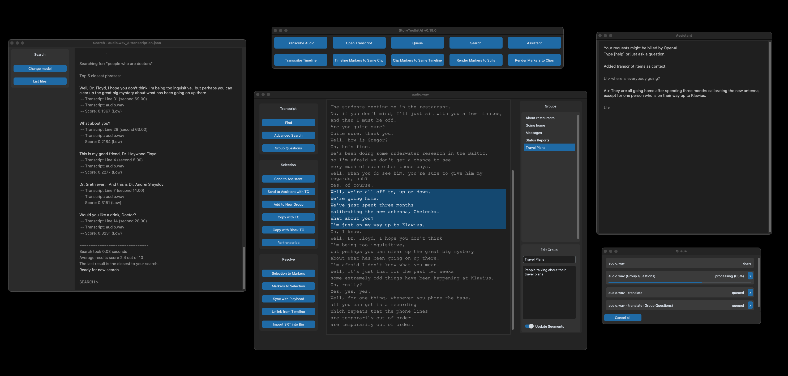

# StoryToolkitAI

## Description

**StoryToolkitAI is a film editing tool that can help editors work more efficiently by automatically transcribing audio
and allowing them to search transcripts semantically with the help of AI.**

The tool works locally on your machine, independent of any other editing software, but it also integrates with DaVinci 
Resolve Studio 18 and above.

Recently, we've added a direct interface with **ChatGPT** which allows the use the state-of-the-art AI to analyze 
transcripts and have conversations about them with AI.

## Key Features
- [x] **Full video indexing and search** (experimental, v. 0.19.2+)
- [x] **Free Automatic Transcriptions** on your local machine
- [x] **Free Automatic Translation** to English on your local machine
- [x] **ChatGPT integration** - talk to AI about your content, or generate new ideas
- [x] **Search Content** intuitively without having to type in exact words
- [X] **Transcript Groups** - group transcript lines into whatever you need to find them easier
- [X] Automatic Question detection in transcripts
- [x] Multi-format export of transcripts, including SRT, TXT, AVID DS and as Fusion Text node
- [X] Import of **existing SRT files** 
- [X] Easy copy of timecoded transcript text to clipboard etc.

### Resolve Studio Integrations
- [x] **Mark and Navigate Resolve Timelines via Transcript**, plus other handy Resolve-only features
- [x] **Advanced Search** of Resolve timeline markers using AI
- [x] Copy Resolve timeline markers to transcript and vice-versa for advanced search
- [x] Direct import of subtitles into Resolve bin

### Planned Features
- [ ] **Automatic Topic Classification** to help you discover ideas in your transcripts
- [ ] **Speaker Diarization** 
- [ ] **Paper Edit** and **Automatic Selects**
- [ ] **Translation** to other languages
- [ ] Optimized Assistant feature for cost-effective use of ChatGPT
- [ ] **Integration with other AI tools**
- [ ] **Integration with other software / standalone players**
- [X] Plus more flashy features as clickbait to unrealistically raise expectations and destroy competition

Our plan is to incorporate more AI technologies that make editors' work easier and more efficient, something similar
to having an AI Assistant Editor which knows what is where in your footage and can even classify footage by meaning,
emotions, visual content etc. Automated transcriptions are simply a means to an end.

_The app is in this stage raw and not polished at all, but we use it daily in our editing room._

_Some of the above features are only available in the non-standalone version of the tool, but they will be available
in the standalone version in the next release._

For detailed features info, go [here](https://github.com/octimot/StoryToolkitAI/blob/main/FEATURES.md).

# Download, Setup & Installation

To download the latest standalone release, see [the releases page](https://github.com/octimot/StoryToolkitAI/releases).

For detailed installation instructions 
[go here](https://github.com/octimot/StoryToolkitAI/blob/main/INSTALLATION.md).

## Is it really completely free?
Yes, the tool runs locally and there's no need for any additional account to transcribe or search. These features will
always be free as long as your machine supports them without external services. The only feature that now requires
external services is the Assistant feature which relies on OpenAI ChatGPT.

**Some features are released earlier only to our Patreon Patrons.** If you want to support the development, 
check out our [Patreon page](https://www.patreon.com/StoryToolkitAI) and get some cool perks. 

---

## About data privacy
By the way, if you feel that your content is sensitive or subject to privacy laws, no worries: 
the tool does not send anything that you don't want to the Internet, it only uses your local machine to transcribe and 
translate your audio.

Currently, the only features that send data from your machine to the Internet are:
- the Tool itself is checking whether your StoryToolkitAI API Token is valid (only when entered)
- the Assistant is sending data to the Internet (directly to OpenAI).

---

# Contributions
This tool is coded by Octavian Mot, your unfriendly filmmaker who hates to code and tries to keep it together as
[half of mots](https://mots.us). Our team uses it daily in our editing room which allows us to update it with
features that we need and think will be useful to others.

Feel free to get in touch with compliments, criticism, and even weird ideas for new features.

The tool would be useless without using the following open source projects:
- [OpenAI Whisper](https://openai.com/blog/whisper/)
- [Sentence Transformers](https://www.sbert.net/)
- [OpenAI ChatGPT](https://openai.com/blog/chat-gpt/)
- [spaCy](https://spacy.io/)
- [CustomTkinter](https://customtkinter.tomschimansky.com/)
- and many other packages that can be seen in the requirements.txt file

---

# Known issues
### Hallucinations during audio silence
In some cases, on chunks of audio that are silent, Whisper sometimes writes phrases that aren't there. This is a known
issue. To prevent that from happening, try using the pre-detect speech option in the Transcription Settings Window.

### Tool doesn't connect with Resolve
Make sure that, in Davinci Resolve Preferences -> General, "External Scripting using" is set to Local.
Again, the tool only works with Resolve Studio and *not the free version of Resolve* (not that we know of).

### Standalone version doesn't start or doesn't connect to Resolve
If the tool just hangs when you start it up, or if it doesn't connect to Resolve, most likely there is a conflict
with another Python installation on your machine. The best approach is to uninstall all other Python versions and
try to run the tool again.

### Tool freezing during Resolve playback
Currently, the tool gets stuck as it waits a reply from the Resolve API, while Resolve is playing back, but it gets
un-stuck as soon as the playhead stops moving. This will be fixed in a future update soon.

### Timecode issues with 23.976 timelines
A bug in the Resolve API which sometimes reports 23.976 fps as 23fps creates a bunch of issues mainly for operations
that use timecode (transcript to playhead navigation, adding markers at the precise frame etc.). Unfortunately, this
can only be fixed by Blackmagic within Resolve itself (fingers crossed for an update?)

### Black Interface / Flickering on Intel Macs
Some users are experiencing weirdness with the interface on Intel Macs. This is due to a bug in Tcl/Tk - a package
required to create the interface, which needs to be re-installed together with Python and everything else on the 
machine. Details here and a possible fix 
[here](https://github.com/octimot/StoryToolkitAI/issues/6#issuecomment-1283519594).

### RuntimeError: CUDA out of memory
If you get this message while transcribing on the GPU, it means that your GPU doesn't have enough memory to run the
model you have selected. The solution is to either use a smaller model, or to transcribe on the CPU.

### Tool freezes when chatting with Assistant
The Assistant feature requires an active connection with OpenAI servers, which sometimes can be slow or unresponsive.
We'll try to improve this behavior in the future.

### Please report any other issues
As mentioned, the tool is in a super raw state of development. We use it every day in our editing workflow, but some 
issues might escape us. Please report anything weird that you notice, and we'll look into it.

To report any issues, please use the Issues tab here on Github: https://github.com/octimot/StoryToolkitAI/issues

---
